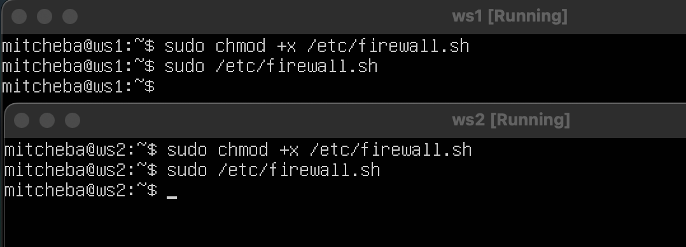
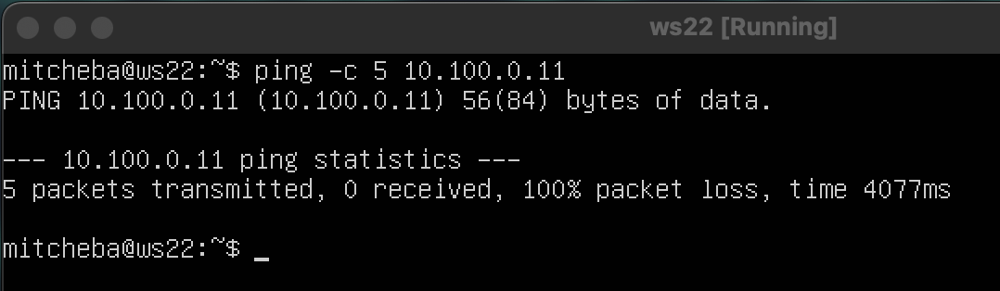
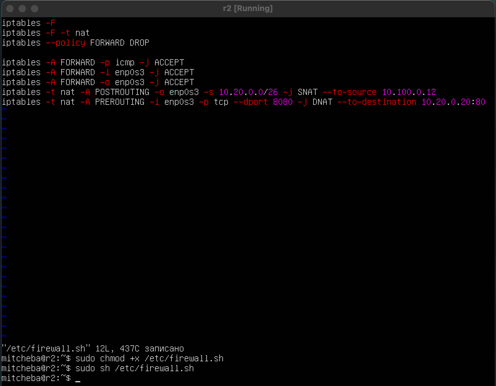

# DO2_LinuxNetwork-1

## Part 1

Поднять виртуальную машину ws1

### 1.1 Сети и маски

Определить и записать в отчет:

1.Адрес сети 192.167.38.54/13

2.Перевод маски 255.255.255.0 в префиксную и двоичную запись, /15 в обычную и двоичную, 11111111.11111111.11111111.11110000 в обычную и префиксную

3.Минимальный и максимальный хост в сети 12.167.38.4 при масках: /8, 11111111.11111111.00000000.00000000, 255.255.254.0 и /4

### 1.2 localhost

Определи и запиши в отчёт, можно ли обратиться к приложению, работающему на localhost, со следующими IP:

    94.34.23.100 - Нельзя обратиться
    127.0.0.2 - Можно обратиться
    127.1.0.1 - Можно обратиться
    128.0.0.1 - Нельзя обратиться

### 1.3 Диапазоны и сегменты сетей

1.Какие из перечисленных IP можно использовать в качестве публичного, а какие только в качестве частных:

Публичные:
`134.43.0.2, 172.0.2.1, 192.172.0.1, 172.68.0.2, 192.169.168.1`

Частные:
`10.0.0.45, 192.168.4.2, 172.20.250.4, 172.16.255.255, 10.10.10.10`

2.Какие из перечисленных IP адресов шлюза возможны у сети `10.10.0.0/18`

Возможны:
`10.10.0.2, 10.10.10.10, 10.10.1.255`

Невозможны:
`10.0.0.1, 10.10.100.1`

## Part 2

Поднять две машины

Опиши сетевой интерфейс, соответствующий внутренней сети, на обеих машинах и задать следующие адреса и маски: ws1 - 192.168.100.10, маска /16, ws2 - 172.24.116.8, маска /12.

### 2.1 Добавление статического маршрута вручную

### 2.2 Добавление статического маршрута с сохранением

Содержание файла

Пропингование соединения

## Part 3

### Скорость соединения

    8 Mbps = 1 MB/s
    100 MB/s = 819200 Kbps
    1 Gbps = 1024 Mbps

### Утилита iperf3

Измерение скорости соединения

## Part 4

### 4.1 Утилита iptables

Скрин с содержанием файла `etc/firewall` для каждой машины

### 4.2 Утилита nmap

Командой ping найти машину, которая не "пингуется"

Обе машины пингуются

## Part 5 Статическая маршрутизация сети

### 5.1 Настройка адресов машин

Скрин с содержанием файла для каждой машины

ws11

r1

r2

ws21

ws22

Перезаписать сервес сети. Командой `ip -4 a`, проверить, что адрес машины задан верно. Пропинговать ws22 с ws21. Аналогично r1 с ws11

### 5.2 Включение переадресации IP-адресов

Поместить скрин с вызовом и выводом команды `sysctl -w net.ipv4.ip_forward=1`

Открыть файл и добавить в него строку `net.ipv4.ip_forward = 1

В отчет поместить скрин с содержанием изменённого файла /etc/sysctl.conf

### 5.3 Установка маршрута по-умолчанию

Настроить маршрут по-умолчанию для рабочих станций. 

Вызов `ip r`, проверка изменения маршрута

Пропинговать с ws11 роутер r2 и показать, что пинг доходит, использовать команду `tcpdump -tn -i eth0`

### 5.4 Добавление статических маршрутов

Добавить в роутеры r1 и r2 статические маршруты в файле конфигураций.

Вызвать `ip r` и показать таблицу с маршрутами на обоих роутерах.

Запуск команды `ip r list 10.10.0.0/[маска сети]` и `ip r list 0.0.0.0/0`

Для ареса 10.10.0.0 был выбран маршрут для его использования. Маршрут по умолчанию срабатывает, когда не найден подходящий маршрут.

### 5.5 Построение списка маршрутизаторов

При помощи утилиты `traceroute` построить список маршрутизаторов на пути от ws11 до ws21

Программа traceroute выполняет отправку данных указанному узлу сети, при этом отображая сведения о всех промежуточных маршрутизаторах, через которые прошли данные на пути к целевому узлу.

### 5.6. Использование протокола ICMP при маршрутизации

Запустить на r1 перехват сетевого трафика, проходящего через eth0 с помощью команды:

`tcpdump -n -i eth0 icmp`

Пропинговать с ws11 несуществующий IP (например, 10.30.0.111) с помощью команды:

`ping -c 1 10.30.0.111`

## Part 6

Указать адрес маршрутизатора по-умолчанию, DNS-сервер и адрес внутренней сети в файле `/etc/dhcp/dhcpd.conf`

В файле resolv.conf прописать `nameserver 8.8.8.8`

Перезагрузить службу DHCP командой `systemctl restart isc-dhcp-server`. Машину ws21 перезагрузить при помощи `reboot` и через `ip a` покажи, что она получила адрес. Также пропингуй ws22 с ws21.

Указать MAC адрес у ws11, для этого в `etc/netplan/00-installer-config.yaml` надо добавить строки: `macaddress: 10:10:10:10:10:BA, dhcp4: true`

Для r1 настроить аналогично r2, но сделать выдачу адресов с жесткой привязкой к MAC-адресу (ws11). Провести аналогичные тесты.

Запросить с ws21 обновление ip адреса.

Пользовался опциями:

    -r: Очистка IP-адреса
    -v: Показ подробного вывода

## Part 7

В файле `/etc/apache2/ports.conf` на ws22 и r1 изменить строку `Listen 80` на `Listen 0.0.0.0:80`, то есть сделай сервер Apache2 общедоступным.

Запустить веб-сервер Apache командой `service apache2 start` на ws22 и r1.

Добавь в фаервол, созданный по аналогии с фаерволом из Части 4, на r2 следующие правила:

1) Удаление правил в таблице filter - iptables -F;

2) Удаление правил в таблице "NAT" - iptables -F -t nat;

3) Отбрасывать все маршрутизируемые пакеты - iptables --policy FORWARD DROP.

Запусти файл также, как в Части 4.

Проверь соединение между ws22 и r1 командой ping.

Добавь в файл ещё два правила:

5) Включи SNAT, а именно маскирование всех локальных ip из локальной сети, находящейся за r2 (по обозначениям из Части 5 - сеть 10.20.0.0).

6) Включи DNAT на 8080 порт машины r2 и добавить к веб-серверу Apache, запущенному на ws22, доступ извне сети.

Проверить соединение по TCP для SNAT: для этого с ws22 подключиться к серверу Apache на r1 командой:
`telnet [адрес] [порт]`

Проверить соединение по TCP для DNAT: для этого с r1 подключиться к серверу Apache на ws22 командой `telnet`

## Part 8

Запустить на r2 фаервол с правилами из Части 7.

Запустить веб-сервер Apache на ws22 только на localhost (то есть в файле `/etc/apache2/ports.conf` измени строку `Listen 80` на `Listen localhost:80`).

Запуск веб-сервера

Воспользуйся Local TCP forwarding с ws21 до ws22, чтобы получить доступ к веб-серверу на ws22 с ws21.

Воспользуйся Remote TCP forwarding c ws11 до ws22, чтобы получить доступ к веб-серверу на ws22 с ws11.

